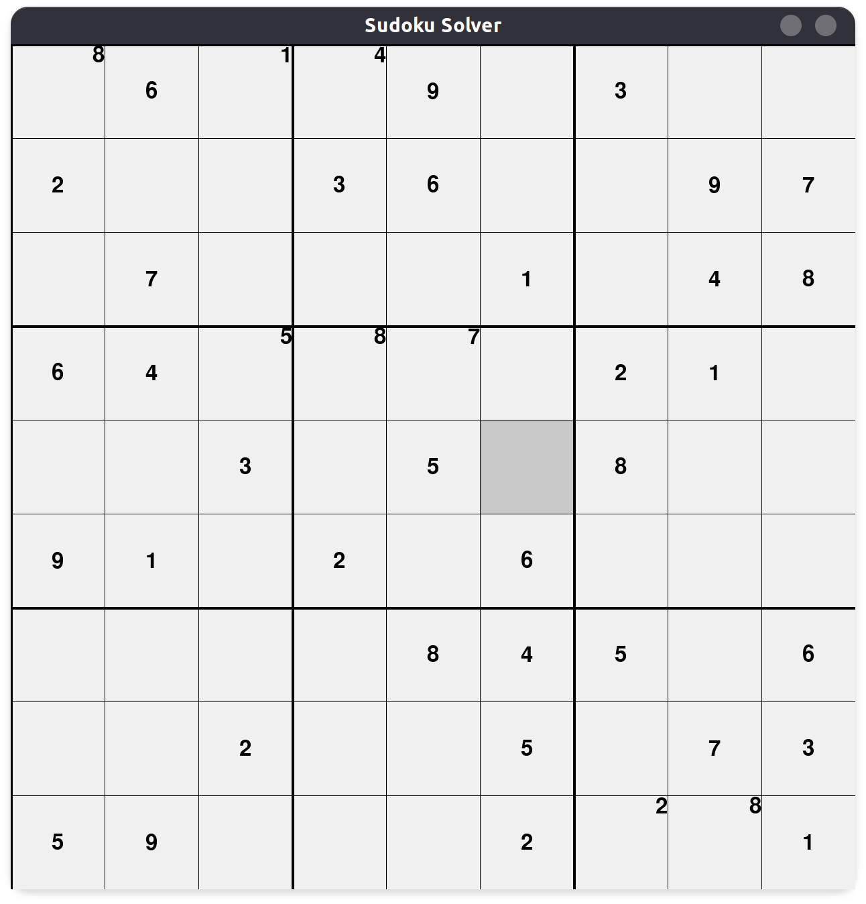
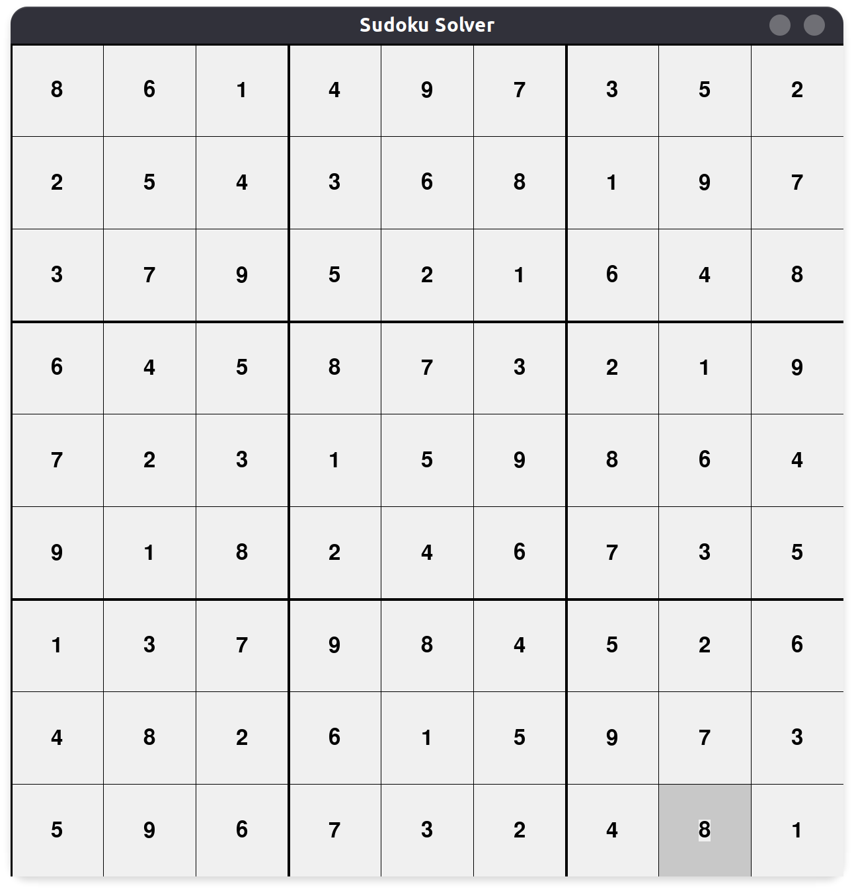

# Sudoku Visualizer

## Description 

This project is a visualization of a simple backtracking algorithm to solve a sudoku. The user can also try to solve the sudoku on its own before watching the algorithm's solution. I was motivated to build this project to practice both my algorithm design and to reinforce my python knowledge. 

I used the pygame library to build the visualization. All the project is object-oriented, as I wanted to expand my knowledge on python classes.

In the future, I hope to polish the visuals of the application and to make it more interactive (adding timer, improving number placement mechanism, saving current sudoku to continue later).

## How to Run

Download the files in one directory and run the following command in terminal:

```bash
    python3 visualizer.py
```

## Usage
Select desired tile to place a number between 1 and 9. This will place a provisional number in the tile. When you are sure of your decision, press *enter* to verify if placed number was correct. If you are stuck or you just want to watch the algorithm solve the sudoku, press key *s*.





## Credits
All data of file "sudoku.csv" is retrieved from Kaggle. Original author is user Kyubyong Parg. File can be downloaded at
https://www.kaggle.com/bryanpark/sudoku/version/3